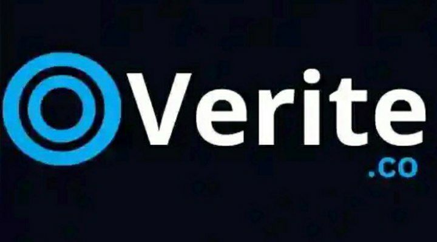

# OVERITE 🌌 - Pipeline Vandalization System using Blockchain Technology
## Introduction 🐎

This project aims to leverage Blockchain technology to safeguard pipelines and also tankers from acts of vandalism. By employing Blockchain's secure and decentralized framework, the system intends to create a tamper-resistant method to monitor, track, and prevent unauthorized access or damage to pipelines. Through this initiative, the project endeavors to enhance the security and integrity of vital infrastructure while minimizing the risks associated with potential sabotage.

There are four basic feature Squad Units of this project, namely:

| **Squad Unit** | **Description** |
|---|---|
|**UI/UX Design**| *Responsible for crafting interfaces that not only look good but also provide a seamless and satisfying experience for users interacting with the system or application.* |
|**Frontend Development**| *Responsible for building the client-side of websites or applications, translating designs into functional and interactive user interfaces using languages like HTML, CSS, and JavaScript.* |
|**Backend Development**| *Handles the server-side of applications, managing databases, server logic, and ensuring smooth communication between the server and the frontend.* |
|**Embedded Systems & Hardware**| *Designs, develops, and integrates hardware components and software systems, creating specialized computing systems tailored for specific tasks or functions, in this case, to monitor and track the safe and secure flow of PMS in pipelines and tankers in realtime.* |

This then categorizes these squad units into two main components,
- **Software Component** ~ focusing on developing systems and interfaces to run logic, database retrieval and information architectural designs.
- **Hardware Component** ~ focusing on designing and integrating hardware components for tasks relating to tracking and monitoring flow in pipelines and tanker location.

Below are the Links to the UI Design and User Flow respectively for this project:

 

# line to the UI/UX file: https://www.figma.com/file/01Q5aK5vqgHaMOoN4UWgRr/Special-app?type=design&node-id=189%3A229&mode=design&t=dSQ4A03mTUxff5hX-1
# line to the user flow : https://www.figma.com/file/01Q5aK5vqgHaMOoN4UWgRr/Special-app?type=design&node-id=189%3A229&mode=design&t=dSQ4A03mTUxff5hX-1 
# fonts be use "Nexa font, Petrov Sans, Lato, lora, NOTE: team leads should pick the forn to use 
# Back end developers should work on a localhost database 
